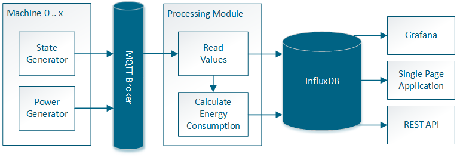

# SDC Produktion - Technik-Check 

## Das Szenario

Ein Generator erzeugt für eine Produktionsanlage Leistungsdaten (in Watt) in hoher Frequenz sowie Maschinenzustandswechsel und publiziert diese über einen MQTT-Broker.
Im Szenario laufen mehrere dieser Maschinen parallel.
Typischerweise kommen im Produktionsumfeld solche Zeitreihendaten aus verschiedenen Quellen.
Die Herausforderung besteht nun in der Verschmelzung beider Datenströme.
Ein Datenverarbeitungsmodul liest kontinuierlich die Rohdaten aller Maschinen vom MQTT-Broker und schreibt diese in eine InfluxDB. 
Gleichzeitig wird für jeden Maschinenzustand der Energieverbrauch (in kWh) berechnet und protokolliert.
Dem Endbenutzer werden die Daten über ein ansprechendes Frontend visualisiert. 

## Aufgabe
Das beschriebene Szenario soll prototypisch bis zum **24.02.2019** (EOB) umgesetzt werden. Wir haben dabei die Aufgabe so aufgeteilt, dass Du Deine Kompetenzen als Backend- oder Frontend-Entwickler demonstrieren kannst. 

- [Du bist ein Backend-Entwickler?](backend)
- [Du bist ein Frontend-Entwickler?](frontend)

Du kannst effizient arbeiten und existierenden Open-Source-Code bzw. -Bibliotheken nachnutzen, aber kennzeichne fremden Code ordnungsgemäß und lizenzkonform.
Verwende dieses GitHub-Repository für die Code-Verwaltung und tagge Dein Repository mit dem Keyword "final", wenn Deine Arbeiten abgeschlossen sind. Bitte dokumentiere in einem Markdown, wie wir Deine Lösung lauffähig einrichten können.

Überzeuge uns an den Stellen, wo Du im Entwicklungsprozess Deine Stärken siehst!

## Ansprechpartner
Bei Fragen zur Aufgabenstellung und Umsetzung wende dich an [Diogo Behrens](mailto:diogo.behrens@volkswagen.de), Tel.: 05361/9995090.
