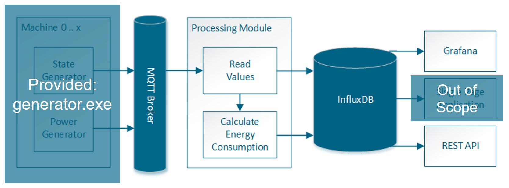

# Du bist ein Backend-Entwickler

Entwickle das Processing Modul, das die Rohdaten in eine [InfluxDB](https://portal.influxdata.com/downloads) schreibt und den Energieverbrauch pro Maschinenzustand (in kWh) berechnet und ebenfalls in der InfluxDB protokolliert.
Wir stellen den Maschinendatengenerator zur Verfügung.
Leistungsdaten werden im Halbsekunden-Takt erzeugt, wobei zufällig Lücken entstehen.
Die Auswahl des MQTT-Brokers (beispielsweise node.js mit Mosca) und der Programmiersprache für die Implementierung sind Dir überlassen.
Als Entwicklungsplattform kannst du Windows, Mac oder Linux verwenden.
Die entsprechenden Binaries für den Generator sind im Repository im [bin-Verzeichnis](bin) hinterlegt. 

Der Energieverbrauch bestimmt sich als Fläche unter der Leistungskurve (area under the curve, AUC).
Für die Berechnung wird der Mittelwert zwei aufeinander folgender Leistungswerte mit der Zeitdifferenz dieser Werte multipliziert (Sehnentrapezformel) und das Ergebnis für den aktuellem Maschinenzustand aufsummiert.

Visualisiere die in der InfluxDB gespeicherten Daten in einem einfachen [Grafana](https://grafana.com/grafana/download)-Dashboard. 
Checke bitte die Dashboard-JSON-Datei im Repository ein.

Des Weiteren wird eine REST-Schnittstelle benötigt, die für eine Maschine in einem bestimmten Zeitraum alle Pfadkombinationen von Zustandswechseln zurückgibt und zählt, wie oft diese durchlaufen werden. Prozesse an den Maschinen beginnen immer mit Zustand 1 und enden mit Zustand 6.
Beispielhafte Rückgabe: {"1-2-6":117,"1-3-6":102,"1-4-5-3-6":62,"1-4-5-6":60}

## Generator Usage

    Usage of generator:
    -broker string
            MQTT broker address (default "localhost:1883")
    -client-id string
            MQTT client ID (default "generator")
    -measurements-topic string
            power measurement topic (default "power-measurements")
    -n int
            number of machines to generate events and measurements for (default 3)
    -transitions-topic string
            state transition topic (default "state-transitions") 

## Nachrichtenformate

### Leistungsdaten

- Default-Topic: power-measurements
- Beispiel: `{"MachineID":"m-2","Value":0.6146602879796196,"Time":"2018-11-14T12:32:01.343942+01:00"}`
- Hinweis: Leistungsdaten werden im Halbsekunden-Takt mit zufälligen Lücken generiert. Einheit von Value ist Watt. Zeitstempel sind RFC3339-Strings.

### Maschinenzustandswechsel
- Default-Topic: state-transitions
- Beispiel: `{"MachineID":"m-0","State":0,"Time":"2018-11-14T12:32:00.8436454+01:00"}`
- Hinweis: Maschinenzustände haben einen definierten Zeitraum, der um ein paar Sekunden variieren kann. Es gibt 6 Zustände. Zeitstempel sind RFC3339-Strings.
