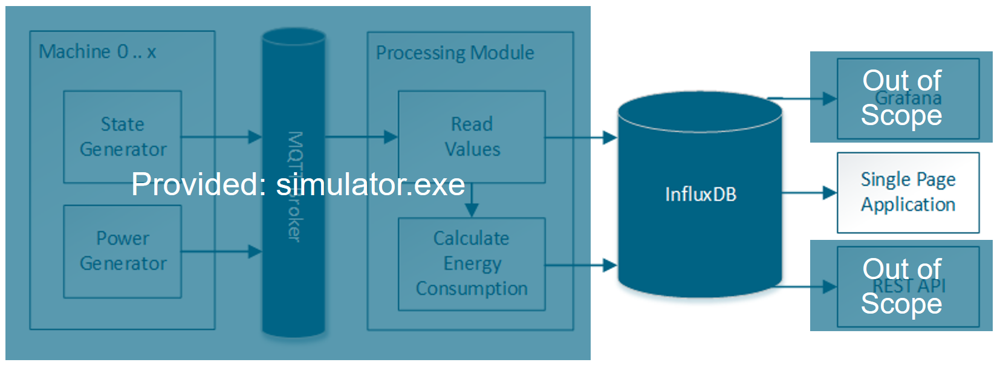

# Du bist ein Frontend-Entwickler

Entwickle eine ansprechende Single-Page-Application im Material Design, die die Zeitreihen- und Verbrauchsdaten aus der [InfluxDB](https://portal.influxdata.com/downloads) (Version 1.7.2) grafisch mittels Linien- und Kreisdiagrammen bzw. Einzelwerte in Kacheln und Tabellen visualisiert. Es soll die Maschine und der Zeitraum für die angezeigten Daten ausgewählt werden können. 
Die Anzeige soll sich über einen einstellbaren Parameter alle paar Sekunden aktualisieren. 
Du bekommst von uns den Generator sowie das Processing Module als kombinierten Maschinendatensimulator zur Verfügung gestellt. 
Als Entwicklungsplattform kannst du Windows, Mac oder Linux verwenden.
Die entsprechenden Binaries für den Simulator sind im Repository im [bin-Verzeichnis](bin) hinterlegt.

Bevor der Simulator gestartet werden kann, muss eine InfluxDB-Datenbank eingerichtet werden, damit die entsprechenden Credentials als Parameter beim Aufruf mitgegeben werden können.

## Mockup

## Simulator Usage

    Usage of simulator:
    -influx-address string
            influxDB address (default "http://localhost:8086")
    -influx-database string
            influxDB database (default "mydb")
    -influx-password string
            influxDB password (default "admin")
    -influx-username string
            influxDB username (default "admin")
    -n int
            number of machines to generate events and measurements for (default 3)

## InfluxDB Schemas

### Leistungsdaten
- Tabelle: power-measurements
- Fields: "value" - measurement in Watt
- Tags: 
    - "id" - machine id
    - "state" - current machine state

### Maschinenzustandswechsel und AUC
- Tabelle: state-transitions
- Fields:
    - "state" - next machine state
    - "auc" - AUC in kWh for state before transition
- Tags: 
    - "id" - machine id
    - "state" - machine state before transition

## Lösung

### Starten der Anwendung
Zum Starten der Anwendung muss Docker (inkl. Docker Compose) sowie ein InfluxDB-Client auf dem Rechner 
installiert sein. Alternativ kann die Datenbank natürlich lokal installiert werden.

> Docker Compose

    sdc-technik-check-stefanil/frontend/docker$ docker-compose up
    
> Datenbank erzeugen
    
    influx -precision rfc3339
    
    > CREATE DATABASE mydb
    
> Skript zur Simulation ausführen 

    sdc-technik-check-stefanil/frontend/bin$ ./simulator-linux-amd64

> Web App lokal ausführen

    sdc-technik-check-stefanil$ ./gradlew npm_start
    
> Zusatz: Chronograf
    
    http://localhost:8888
    
... Explore    
    
    SELECT * FROM mydb.."power-measurements"

### Bemerkungen
Da es sich hierbei um einen Prototypen mit begrenztem Zeitkontingent zur Umsetzung handelt,
wurde auf die Implementierung der Unit-und Akzeptanztest (E2E) verzichtet. Auch die 
Nutzung des Material-UI-Kits sowie entsprechender Chart-Bibliotheken ist aus diesem Grund
noch nicht optimal.

Aus den genannten Gründen wurde ebenfalls auf die UI-gestützte Auswahl der Periodendauer für
den Reload der Daten verzichtet. Die Daten werden momentan fix aller 5 Sekunden neu aus der
InfluxDB gezogen.

Die Anwendung wurde nicht "from scratch" entwickelt, da bereits eine fortgeschrittene Code-Basis
mit vielen benötigten Anhängigkeiten existierte. 
Ein nächster Schritt wäre folglich das Entfernen unbenutzter in Zukunft nicht mehr benötigter 
NPM-Abhängigkeiten.
